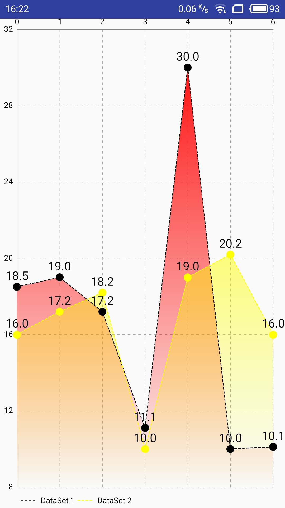
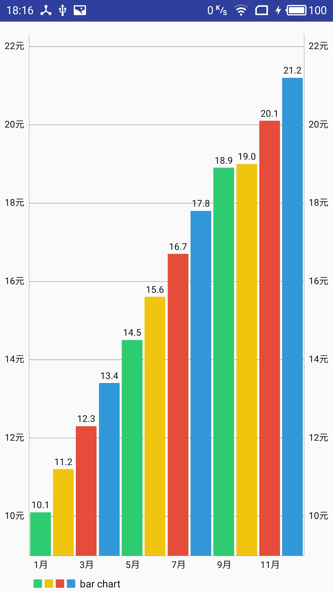
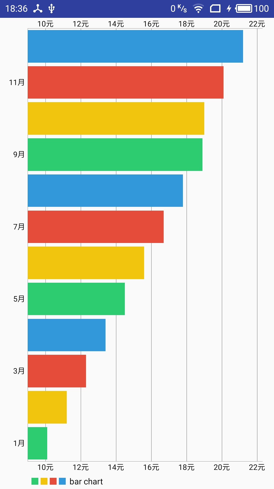
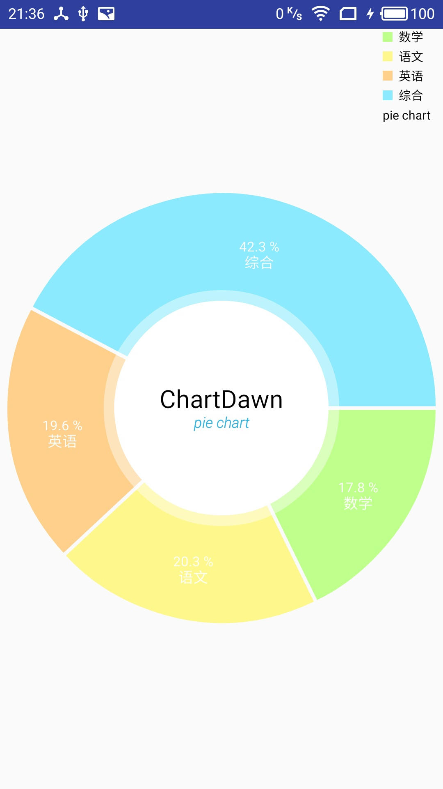
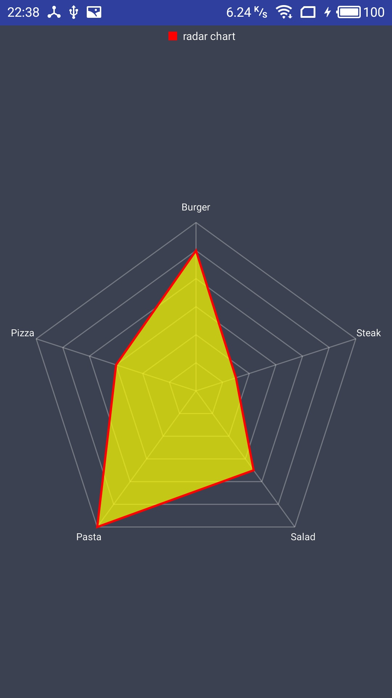

# chart的使用

* [chart引用](#chart引用)
* [LineChart使用](#linechart使用)
    * [LineChart事件的相关设置](#linechart事件的相关设置)
        * [setTouchEnabled](#settouchenabled)
        * [setScaleEnabled](#setscaleenabled)
        * [getDescription](#getdescription)
        * [animateX](#animateX)
        * [getLegend](#getlegend)
        * [getAxisRight](#getaxisright)
        * [getXAxis](#getxaxis)
        * [getAxisLeft](#getaxisleft)
        * [setMarker](#setmarker)
        * [MarkerView](#markerview)
        * [setOnChartValueSelectedListener](#setonchartvalueselectedlistener)
    * [LineChart展示的相关设置](#linechart展示的相关设置)
        * [LineChart控件](#linechart控件)
        * [Entry](#entry)
        * [LineDataSet](#linedataset)
        * [ArrayList<ILineDataSet>](#arraylist<ilinedataset>)
        * [LineData](#linedata)
        * [LineChart的数据添加](#linechart的数据添加)
        * [线性图表的刷新](#线性图表的刷新)
* [BarChart使用](#barchart使用)
    * [BarChart事件的相关设置](#barchart事件的相关设置)
        * [setDrawBarShadow](#setdrawbarshadow)
        * [setDrawValueAboveBar](#setdrawvalueabovebar)
        * [getDescription](#getdescription)
        * [animateX](#animatex)
        * [getXAxis](#getxaxis)
        * [IAxisValueFormatter](#iaxisvalueformatter)
        * [getAxisLeft](#getaxisleft)
        * [getLegend](#getlegend)
        * [setMarker](#setmarker)
        * [MarkerView](#markerview)
        * [setOnChartValueSelectedListener](#setonchartvalueselectedlistener)
    * [BarChart展示的相关设置](#barchart展示的相关设置)
        * [BarChart控件](#BarChart控件)
        * [BarEntry](#barentry)
        * [BarDataSet](#BarDataSet)
        * [List<IBarDataSet>](#list<ibardataset>)
        * [BarData](#bardata)
* [HorizontalBarChart使用](#horizontalbarchart使用)
* [PieChart使用](#piechart使用)
    * [PieChart事件的相关设置](#piechart事件的相关设置)
        * [setUsePercentValues](#setusepercentvalues)
        * [getDescription](#getdescription)
        * [setCenterText](#setcentertext)
        * [setDrawHoleEnabled](#setdrawholeenabled)
        * [setHoleColor](#setholecolor)
        * [setTransparentCircleColor](#settransparentcirclecolor)
        * [setTransparentCircleAlpha](#settransparentcirclealpha)
        * [setDrawCenterText](#setdrawcentertext)
        * [setRotationAngle](#setrotationangle)
        * [animateY](#animatey)
        * [getLegend](#getlegend)
        * [setOnChartValueSelectedListener](#setonchartvalueselectedlistener)
    * [PieChart展示的相关设置](#piechart展示的相关设置)
        * [PieChart控件](#piechart控件)
        * [PieEntry](#pieentry)
        * [PieDataSet](#piedataset)
        * [PieData](#piedata)
* [RadarChart使用](#radarchart使用)
    * [RadarChart事件的相关设置](#radarchart事件的相关设置)
        * [setBackgroundColor](#setbackgroundcolor)
        * [getDescription](#getdescription)
        * [setWebLineWidth](#setweblinewidth)
        * [setWebColor](#setwebcolor)
        * [setWebAlpha](#setwebalpha)
        * [setWebLineWidthInner](#setweblinewidthinner)
        * [setWebColorInner](#setwebcolorinner)
        * [setMarker](#setmarker)
        * [animateXY](#animatexy)
        * [getXAxis](#getxaxis)
        * [getYAxis](#getyaxis)
        * [getLegend](#getlegend)
    * [RadarChart展示的相关设置](#radarchart展示的相关设置)
        * [RadarChart控件](#radarchart控件)
        * [RadarEntry](#radarentry)
        * [RadarDataSet](#radardataset)
        * [List<IRadarDataSet>](#list<iradardataset>)
        * [RadarData](#radardata)
    


## chart引用

Add the following to your project level build.gradle:
```
allprojects {
	repositories {
		maven { url "https://jitpack.io" }
	}
}
```

Add this to your app build.gradle:
```
dependencies {
	compile 'com.github.PhilJay:MPAndroidChart:v3.0.2'
}
```

## LineChart使用



[返回顶部](#chart的使用)
### LineChart事件的相关设置

#### setTouchEnabled
是否可以触摸
```
lineChart.setTouchEnabled(true);//图表是否可以触摸
```

#### setScaleEnabled
是否可以缩放
```
lineChart.setScaleEnabled(true);//图表是否可以放大缩小
```

#### getDescription
下方的lebel是否显示
```
lineChart.getDescription().setEnabled(false);//右下角的label是否显示
```

#### animateX
图表显示的动画
```
lineChart.animateX(500);
```

#### getLegend
下方线legend的样式
```
Legend legend = lineChart.getLegend();
legend.setForm(Legend.LegendForm.LINE);//设置下方legend显示样式
```

#### getAxisRight
右侧y轴数字是否显示
```
lineChart.getAxisRight().setEnabled(false);//右侧y轴不显示
```

#### getXAxis
设置x轴对应的线的样式
```
XAxis xAxis = lineChart.getXAxis();
xAxis.enableGridDashedLine(10f, 10f, 0f);//设置x轴对应的线的样式
```

#### getAxisLeft
设置y轴对应的线的样式
```
YAxis leftAxis = lineChart.getAxisLeft();
leftAxis.enableGridDashedLine(10f, 10f, 0f);//设置y轴对应的线的样式
```

#### setMarker
点击时弹窗显示的标识
```
LineMarkerView lineMarkerView = new LineMarkerView(this, R.layout.custom_marker_view);
lineMarkerView.setChartView(lineChart);
lineChart.setMarker(lineMarkerView);//点击时弹窗显示
```

#### MarkerView
MarkerView对应的LineMarkerView的代码
```
public class LineMarkerView extends MarkerView {
    private TextView tvContent;
    public LineMarkerView(Context context, int layoutResource) {
        super(context, layoutResource);
        tvContent = (TextView) findViewById(R.id.tvContent);
    }
    @Override
    public void refreshContent(Entry e, Highlight highlight) {

        if (e instanceof CandleEntry) {
            CandleEntry ce = (CandleEntry) e;
//            tvContent.setText("" + Utils.formatNumber(ce.getHigh(), 0, true));
            tvContent.setText("" + ce.getHigh());
        } else {
//            tvContent.setText("" + Utils.formatNumber(e.getY(), 0, true));
            tvContent.setText("" + e.getY());
        }
        super.refreshContent(e, highlight);
    }

    @Override
    public MPPointF getOffset() {
        return new MPPointF(-(getWidth() / 2), -getHeight());
    }
}
```

#### setOnChartValueSelectedListener
图表点的点击事件
```
lineChart.setOnChartValueSelectedListener(new OnChartValueSelectedListener() {
    @Override
    public void onValueSelected(Entry entry, Highlight highlight) {
        toastUI(entry.getY() + "");
    }

    @Override
    public void onNothingSelected() {
        toastUI("nothing");
    }
});
```

[返回顶部](#chart的使用)
### LineChart展示的相关设置

#### LineChart控件
Line Chart的xml中引用
```
<com.github.mikephil.charting.charts.LineChart
    android:id="@+id/line_chart"
    android:layout_width="match_parent"
    android:layout_height="match_parent"/>
```

#### Entry
图表的数据（纯数据）
```
new Entry(i, model.getNum(), getResources().getDrawable(R.drawable.star));
```
Entry里面分别对应x轴数据，y轴数据，和点的图片

#### LineDataSet
图表的设置，包括数据，样式等。
```
LineDataSet dataSet = new LineDataSet(entries, "LineChart 1");
```
样式设置，第一个参数是Entry的集合，第二个参数是曲线对应的意思  
线的设置还有很多，其中包括
```
dataSet.setDrawIcons(false);//是否采用Entry里面的图片
dataSet.enableDashedLine(10f, 5f, 0f);//两点之间线的设置，每段线长，间隔长
dataSet.enableDashedHighlightLine(10f, 5f, 0f);
dataSet.setColor(Color.BLACK);//线的颜色
dataSet.setCircleColor(Color.BLACK);//点的颜色
dataSet.setLineWidth(1f);//线的宽度
dataSet.setCircleRadius(5f);//点的弧度，半径
dataSet.setDrawCircleHole(false);//点是否有空
dataSet.setValueTextSize(15f);//每个点的文字大小
dataSet.setDrawFilled(true);//每段下方是否填充颜色
//下面的属性需要设置lineChart的legend
dataSet.setFormLineWidth(1f);//下方线区分中的线的宽度
dataSet.setFormSize(20f);//下方线的区分中线的大小
dataSet.setFormLineDashEffect(new DashPathEffect(new float[]{10f, 5f}, 0f));//下方线区分中线的样式
Drawable drawable = ContextCompat.getDrawable(this, R.drawable.fade_red);
dataSet.setFillDrawable(drawable);//设置点下方颜色的填充
```

#### ArrayList<ILineDataSet>
对图表的设置的集合
```
ArrayList<ILineDataSet> dataSets = new ArrayList<ILineDataSet>();
dataSets.add(dataSet);
``` 
所有线的属性的集合，参数是LineDataSet

#### LineData
图表的所有的数据（包括样式）
```
LineData lineData = new LineData(dataSets);
```
控件对应的最直接的数据，包括所有线的设置和所有数据，参数ArrayList<ILineDataSet>

#### LineChart的数据添加
```
lineChart.setData(lineData);
```
线性图表的数据添加，参数是LineData

#### 线性图表的刷新
```
LineDataSet dataSet = (LineDataSet)lineChart.getData().getDataSetByIndex(0);
dataSet.setValues(entries);
lineChart.getData().notifyDataChanged();
lineChart.notifyDataSetChanged();
```


## BarChart使用



[返回顶部](#chart的使用)
### BarChart事件的相关设置

#### setDrawBarShadow
设置圆柱部分外是否阴影显示
```
barChart.setDrawBarShadow(false);//除了圆柱外其他部分是否填充阴影
```

#### setDrawValueAboveBar
是否将值写到圆柱的上方
```
barChart.setDrawValueAboveBar(true);//是否将值写到圆柱上方
```

#### getDescription
设置右下角的description是否显示
```
barChart.getDescription().setEnabled(false);//右下角的description是否显示
```

#### animateX
动画设置
```
arChart.animateX(1000);//动画效果
```

#### getXAxis
获取x轴的设置
```
XAxis xAxis = barChart.getXAxis();
xAxis.setPosition(XAxis.XAxisPosition.BOTTOM);
//        xAxis.setGranularity(1f);
xAxis.setLabelCount(6);//x坐标label数量最大
xAxis.setDrawGridLines(false);
xAxis.setValueFormatter(new BarAxisValueFormatter().new XAxisValueFormatter());
```

#### IAxisValueFormatter
设置x轴和y轴对应的数据
```
public class BarAxisValueFormatter {
    public class XAxisValueFormatter implements IAxisValueFormatter {
    
        @Override
        public String getFormattedValue(float value, AxisBase axis) {
            return ((int) value + 1) + "月";
        }
    }
    public class YAxisValueFormatter implements IAxisValueFormatter {
    
        @Override
        public String getFormattedValue(float value, AxisBase axis) {
            return ((int) value) + "元";
        }
    }
}
```

#### getAxisLeft
获取左侧y轴的设置
```
YAxis leftAxis = barChart.getAxisLeft();
leftAxis.setValueFormatter(new BarAxisValueFormatter().new YAxisValueFormatter());
```

#### getLegend
获取下方legend，并且进行设置
```
Legend legend = barChart.getLegend();
legend.setVerticalAlignment(Legend.LegendVerticalAlignment.BOTTOM);//设置legend在图形下方
legend.setHorizontalAlignment(Legend.LegendHorizontalAlignment.LEFT);//设置legend和图形左对齐
legend.setOrientation(Legend.LegendOrientation.HORIZONTAL);//设置legend和图形的位置关系
legend.setDrawInside(false);//legend和图形是否显示一起
legend.setForm(Legend.LegendForm.SQUARE);//legend图形样式
legend.setFormSize(9f);//设置legend的方格大小
legend.setTextSize(11f);//设置legend的文字大小
//        legend.setXEntrySpace(4f);
```

#### setMarker
设置点击图表某项时的效果
```
BarMarkerView barMarkerView = new BarMarkerView(this, new BarAxisValueFormatter().new XAxisValueFormatter());
barMarkerView.setChartView(barChart);
barChart.setMarker(barMarkerView);
```

#### MarkerView
点击图表某项时设置的MarkerView
```
public class BarMarkerView extends MarkerView {

    private TextView tvContent;
    private IAxisValueFormatter xAxisValueFormatter;

    private DecimalFormat format;

    public BarMarkerView(Context context, IAxisValueFormatter xAxisValueFormatter) {
        super(context, R.layout.custom_marker_view);

        this.xAxisValueFormatter = xAxisValueFormatter;
        tvContent = (TextView) findViewById(R.id.tvContent);
        format = new DecimalFormat("###.0");
    }

    // callbacks everytime the MarkerView is redrawn, can be used to update the
    // content (user-interface)
    @Override
    public void refreshContent(Entry e, Highlight highlight) {

        tvContent.setText("x: " + xAxisValueFormatter.getFormattedValue(e.getX(), null) + ", y: " + format.format(e.getY()));

        super.refreshContent(e, highlight);
    }

    @Override
    public MPPointF getOffset() {
        return new MPPointF(-(getWidth() / 2), -getHeight());
    }
}
```

#### setOnChartValueSelectedListener
圆柱的点击事件
```
barChart.setOnChartValueSelectedListener(new OnChartValueSelectedListener() {
    @Override
    public void onValueSelected(Entry entry, Highlight h) {
        toastUI(entry.getY() + "");
    }

    @Override
    public void onNothingSelected() {
        toastUI("nothing");
    }
});
```

[返回顶部](#chart的使用)
### BarChart展示的相关设置

#### BarChart控件
BarChart 在xml中引用
```
<com.github.mikephil.charting.charts.BarChart
    android:id="@+id/bar_chart"
    android:layout_width="match_parent"
    android:layout_height="match_parent"/>
```

#### BarEntry
BarChart 对应的图表的数据（只有数据和图片,最小设置数据单位）
```
new BarEntry(i, model.getNum(), getResources().getDrawable(R.mipmap.ic_launcher))
```

#### BarDataSet
圆柱图表的单个圆柱设置
```
BarDataSet dataSet = new BarDataSet(barEntries, "bar chart");
dataSet.setDrawIcons(false);//是否采用Entry里面的图片
dataSet.setColors(ColorTemplate.MATERIAL_COLORS);//设置圆柱的颜色
```

#### List<IBarDataSet>
每个圆柱设置的集合
```
List<IBarDataSet> dataSets = new ArrayList<>();
dataSets.add(dataSet);
```

#### BarData
BarChart对应的数据，包含所有的相关设置信息
```
BarData barData = new BarData(dataSets);
barData.setValueTextSize(10f);//设置文字大小
barData.setBarWidth(0.9f);//设置圆柱宽度
barChart.setData(barData);
```

## HorizontalBarChart使用



横向圆柱图表
和BarChart的相关属性一致，不同的是控件
```
<com.github.mikephil.charting.charts.HorizontalBarChart
    android:id="@+id/horizontal_bar_chart"
    android:layout_width="match_parent"
    android:layout_height="match_parent"/>
```

## PieChart使用



[返回顶部](#chart的使用)
### PieChart事件的相关设置

#### setUsePercentValues
设置饼状图显示为百分比，设置这个属性的同时需要设置pieData.setValueFormatter
```
pieChart.setUsePercentValues(true);//当前值显示成百分比，如果不设置这个属性pieData.setValueFormatter设置显示的是错误的
```

#### getDescription
设置右下角的description不显示
```
pieChart.getDescription().setEnabled(false);//右下角description不显示
```

#### setCenterText
设置中间文字
```
pieChart.setCenterText(generateCenterSpannableText());//设置中间文字
```
其中generateCenterSpannableText的代码为：
```
private SpannableString generateCenterSpannableText() {
    SpannableString s = new SpannableString("ChartDawn\npie chart");
    s.setSpan(new RelativeSizeSpan(1.7f), 0, 9, 0);
    s.setSpan(new StyleSpan(Typeface.NORMAL), 9, s.length() - 10, 0);
    s.setSpan(new ForegroundColorSpan(Color.GRAY), 9, s.length() - 10, 0);
    s.setSpan(new RelativeSizeSpan(.8f), 9, s.length() - 10, 0);
    s.setSpan(new StyleSpan(Typeface.ITALIC), s.length() - 9, s.length(), 0);
    s.setSpan(new ForegroundColorSpan(ColorTemplate.getHoloBlue()), s.length() - 9, s.length(), 0);
    return s;
}
```

#### setDrawHoleEnabled
是否显示成同心圆的形式
```
pieChart.setDrawHoleEnabled(true);//是否显示成同心圆的形式
```

#### setHoleColor
设置同心圆中心的颜色
```
pieChart.setHoleColor(Color.WHITE);//同心圆的圆心颜色
```

#### setTransparentCircleColor
设置同心圆的内圈和外圈之间的颜色
```
pieChart.setTransparentCircleColor(Color.WHITE);//设置同心圆的中心圆和外圈之间的颜色
```

#### setTransparentCircleAlpha
设置同心圆的内圈和外圈之间的颜色透明度
```
pieChart.setTransparentCircleAlpha(110);//设置同心圆的中心圆和外圈之间的颜色透明度
```

#### setDrawCenterText
设置中间文字是否显示
```
pieChart.setDrawCenterText(true);//是否显示中间的文字
```

#### setRotationAngle
设置饼状图旋转角度
```
pieChart.setRotationAngle(0);//旋转的角度
```

#### animateY
设置饼状图的动画
```
pieChart.animateY(1400, Easing.EasingOption.EaseInOutQuad);//动画
```

#### getLegend
设置legend的相关属性
```
Legend legend = pieChart.getLegend();//legend的设置
legend.setVerticalAlignment(Legend.LegendVerticalAlignment.TOP);
legend.setHorizontalAlignment(Legend.LegendHorizontalAlignment.RIGHT);
legend.setOrientation(Legend.LegendOrientation.VERTICAL);
legend.setDrawInside(false);
legend.setXEntrySpace(7f);
legend.setYEntrySpace(0f);
legend.setYOffset(0f);
pieChart.setEntryLabelColor(Color.WHITE);
pieChart.setEntryLabelTextSize(12f);
```

#### setOnChartValueSelectedListener
设置点击事件
```
pieChart.setOnChartValueSelectedListener(new OnChartValueSelectedListener() {
    @Override
    public void onValueSelected(Entry entry, Highlight h) {
        toastUI(entry.getY() + "");
    }

    @Override
    public void onNothingSelected() {
        toastUI("nothing");
    }
});
```

[返回顶部](#chart的使用)
### PieChart展示的相关设置

#### PieChart控件
PieChart在xml引用为：
```
<com.github.mikephil.charting.charts.PieChart
    android:id="@+id/pie_chart"
    android:layout_width="match_parent"
    android:layout_height="match_parent"/>
```

#### PieEntry
饼状图的最小数据填充
```
new PieEntry(model.getNum(), model.getIntro(), getResources().getDrawable(R.mipmap.ic_launcher))
```

#### PieDataSet
饼状图每个部分的样式设置
```
PieDataSet dataSet = new PieDataSet(pieEntries, "pie chart");
dataSet.setDrawIcons(false);//不显示实体类中的图片
dataSet.setSliceSpace(3f);//每一个部分分割空白宽度
ArrayList<Integer> colors = new ArrayList<Integer>();
for (int c : ColorTemplate.VORDIPLOM_COLORS)
    colors.add(c);
dataSet.setColors(colors);//设置颜色
```

#### PieData
饼状图数据的添加
```
PieData pieData = new PieData(dataSet);
pieData.setValueTextSize(11f);//值的字体大小
pieData.setValueTextColor(Color.WHITE);//值的字体颜色
pieData.setValueFormatter(new PercentFormatter());//值添加百分比
pieChart.setData(pieData);
```


## RadarChart使用



### RadarChart事件的相关设置

#### setBackgroundColor
设置背景颜色
```
radarChart.setBackgroundColor(Color.rgb(60, 65, 82));//设置图表的背景颜色
```

#### getDescription
设置右下角的description的显示
```
radarChart.getDescription().setEnabled(false);//设置右下角的description不显示
```

#### setWebLineWidth
设置外层每个点到中心点的线的宽度（y轴）
```
radarChart.setWebLineWidth(1f);//设置每个角到中心的线的宽度
```

#### setWebColor
设置外层每个点到中心点的线的颜色（y轴）
```
radarChart.setWebColor(Color.LTGRAY);//设置每个角到中心的线的颜色
```

#### setWebAlpha
设置外层所有线的颜色的透明度（y轴和x轴）
```
radarChart.setWebAlpha(100);//设置外圈的线的透明度（包括每个角到中心的线和外圈的线）
```

#### setWebLineWidthInner
设置外层的线的宽度（x轴）
```
radarChart.setWebLineWidthInner(1f);//设置外圈的线的宽度
```

#### setWebColorInner
设置外层的线的颜色（x轴）
```
radarChart.setWebColorInner(Color.LTGRAY);//设置外圈的线的颜色
```

#### setMarker
设置点击的markerView
```
MarkerView mv = new RadarMarkerView(this, R.layout.radar_markerview);//设置点击时的markerView
mv.setChartView(radarChart);
radarChart.setMarker(mv);
```
自定义markView的代码：
```
public class RadarMarkerView extends MarkerView {

    private TextView tvContent;
    private DecimalFormat format = new DecimalFormat("##0");

    public RadarMarkerView(Context context, int layoutResource) {
        super(context, layoutResource);

        tvContent = (TextView) findViewById(R.id.tvContent);
    }

    @Override
    public void refreshContent(Entry e, Highlight highlight) {
        tvContent.setText(format.format(e.getY()) + " %");

        super.refreshContent(e, highlight);
    }

    @Override
    public MPPointF getOffset() {
        return new MPPointF(-(getWidth() / 2), -getHeight() - 10);
    }
}
```

#### animateXY
设置显示动画
```
radarChart.animateXY(
    1400, 1400,
    Easing.EasingOption.EaseInOutQuad,
    Easing.EasingOption.EaseInOutQuad);//设置动画
```

#### getXAxis
设置x轴的相关属性
```
XAxis xAxis = radarChart.getXAxis();//设置外层的文字等相关属性
xAxis.setTextSize(9f);
xAxis.setYOffset(0f);
xAxis.setXOffset(0f);
xAxis.setValueFormatter(new IAxisValueFormatter() {

    private String[] mActivities = new String[]{"Burger", "Steak", "Salad", "Pasta", "Pizza"};

    @Override
    public String getFormattedValue(float value, AxisBase axis) {
        return mActivities[(int) value % mActivities.length];
    }
});
xAxis.setTextColor(Color.WHITE);
```

#### getYAxis
设置y轴的相关属性
```
YAxis yAxis = radarChart.getYAxis();//设置外层点到中间点的文字属性
yAxis.setLabelCount(5, false);
yAxis.setTextSize(9f);
yAxis.setAxisMinimum(0f);
yAxis.setAxisMaximum(80f);
yAxis.setDrawLabels(false);
```

#### getLegend
设置legend
```
Legend legend = radarChart.getLegend();//设置lebel
legend.setVerticalAlignment(Legend.LegendVerticalAlignment.TOP);
legend.setHorizontalAlignment(Legend.LegendHorizontalAlignment.CENTER);
legend.setOrientation(Legend.LegendOrientation.HORIZONTAL);
legend.setDrawInside(false);
legend.setXEntrySpace(7f);
legend.setYEntrySpace(5f);
legend.setTextColor(Color.WHITE);
```

### RadarChart展示的相关设置

#### RadarChart控件
RadarChart在xml中的引用
```
<com.github.mikephil.charting.charts.RadarChart
    android:id="@+id/radar_chart"
    android:layout_width="match_parent"
    android:layout_height="match_parent"/>
```

#### RadarEntry
RadarChart的数据（最小数据单位）
```
new RadarEntry(model.getNum())
```

#### RadarDataSet
RadarChart数据线的属性设置
```
RadarDataSet dataSet = new RadarDataSet(radarEntries, "radar chart");
dataSet.setColor(Color.RED);//雷达状图表线的颜色
dataSet.setFillColor(Color.YELLOW);//中间填充的颜色，需要设置setDrawFilled
dataSet.setDrawFilled(true);//是否设置中间填充
dataSet.setFillAlpha(180);//设置填充的透明度
dataSet.setLineWidth(2f);//设置中间线的宽度
```

#### List<IRadarDataSet>
RadarChart线的属性设置的集合
```
List<IRadarDataSet> dataSets = new ArrayList<>();
dataSets.add(dataSet);
```

#### RadarData
RadarChart添加最直接的数据（包含其他属性等所有设置）
```
RadarData radarData = new RadarData(dataSets);
radarData.setValueTextSize(8f);//设置中间线对应的文字大小
radarData.setDrawValues(false);//设置中间线对应的文字是否显示
radarData.setValueTextColor(Color.BLUE);//设置中间线对应的文字的颜色
radarChart.setData(radarData);
```
